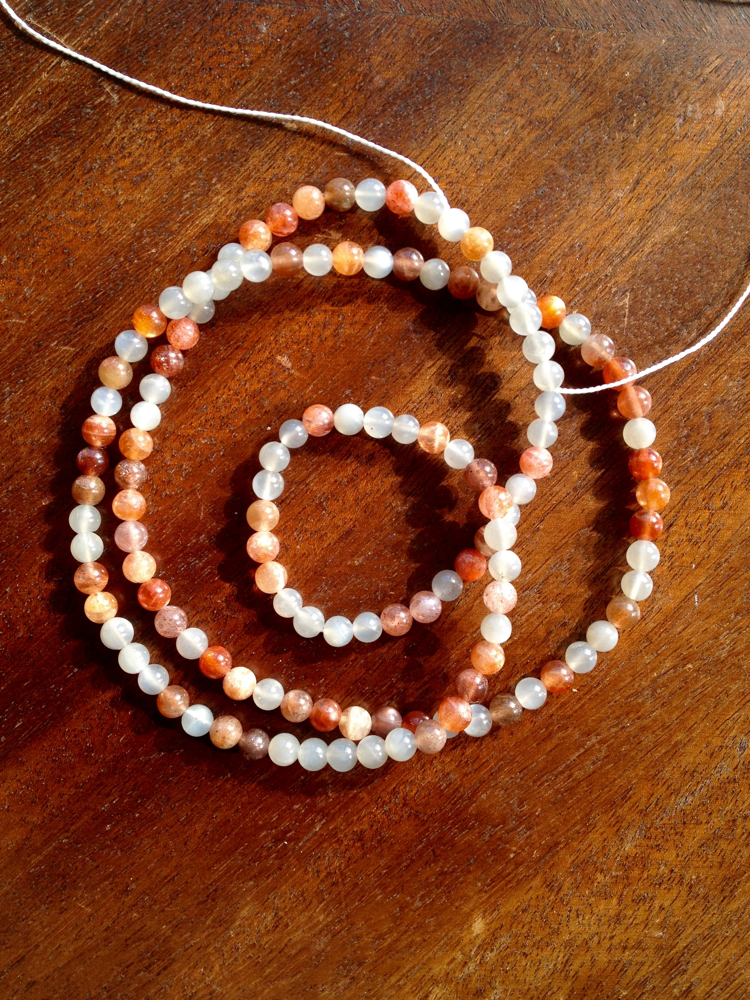
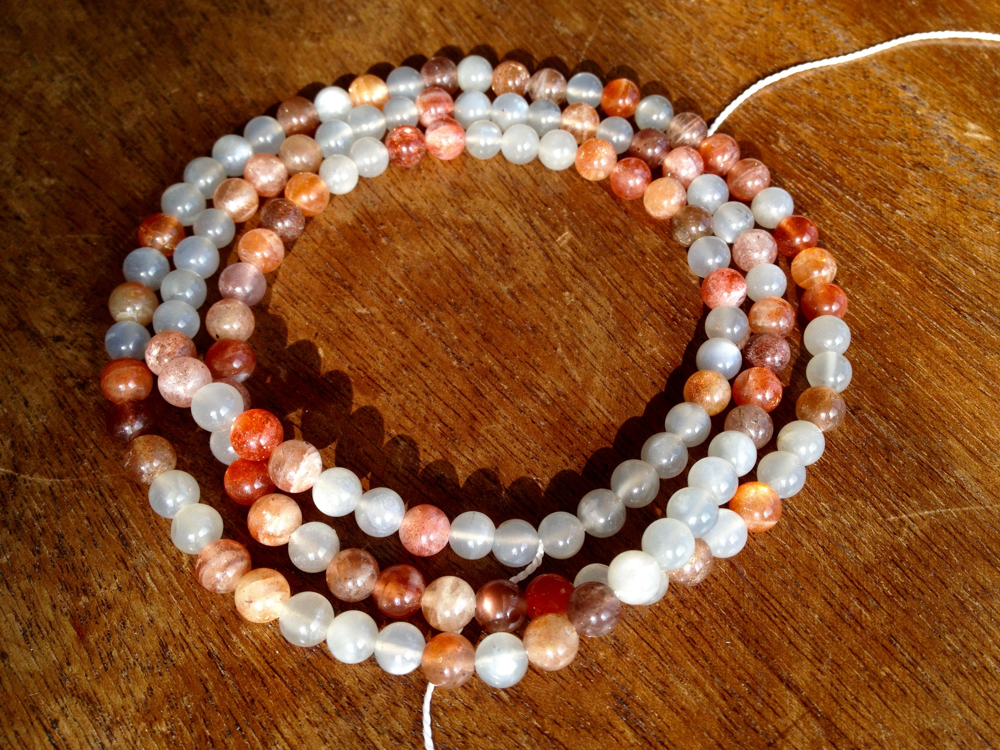
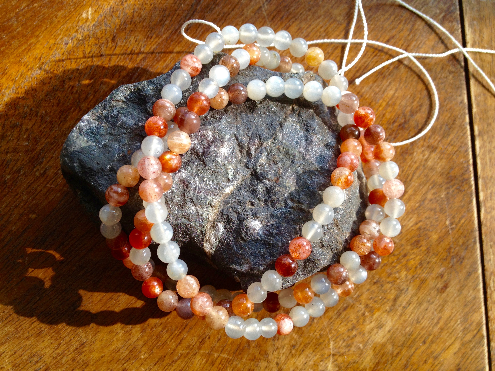

I wrote this program to generate a random [de Bruijn sequences](https://en.wikipedia.org/wiki/De_Bruijn_sequence) in order to create a necklace.





The beads are sunstones and moonstones arranged in the (2, 7)-sequence
```haskell
Misc.DeBruijnSequence> deBruijnSequenceIO 2 7
[0,1,0,0,0,0,0,0,0,1,0,0,1,1,0,1
,1,0,0,0,0,1,1,1,0,0,0,1,0,0,0,1
,0,1,1,0,0,1,0,1,1,1,1,0,0,0,0,0
,1,1,0,1,0,0,0,1,1,0,0,1,1,1,0,1
,0,1,0,0,0,0,1,0,1,0,1,0,1,1,0,1
,0,1,1,1,0,1,1,1,0,0,1,0,0,1,0,1
,0,0,1,1,1,1,1,0,1,1,0,1,1,1,1,1
,1,1,0,0,1,1,0,0,0,1,1,1,1,0,1,0]
```
with 1 = sunstone and 0 = moonstone.

Not only blatantly symbolic bordering on kitsch, but nerdishly containing every 7-bit ASCII code once and only once, not to mention pretty.
